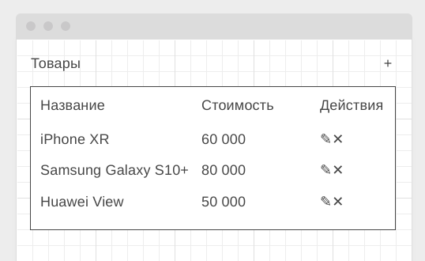

# 5.2_redactor
#### Легенда

Вы делаете CRM-систему, где в списке представлены товары, выглядеть это должно примерно так, как на скетче:

#### Описание

Вам нужно реализовать базовые операции CRUD (create, read, update, delete).

При нажатии на кнопку редактирования или добавления должно открываться всплывающее окно:

Обратите внимание, если вы нажимаете на кнопку "+" (добавить), то окно пустое, если вы нажимаете "✎" (редактировать), то поля заполнены.

Только после нажатия на кнопке "Сохранить", данные в таблице должны обновляться.

Обеспечьте валидацию данных: удостоверьтесь, что в полях название и стоимость есть текст, причём в поле стоимость допустимы только числа больше 0 (в памяти стоимость должна храниться в виде числа, а не в виде строки). Если ошибки присутствуют, отображайте их под полями ввода в виде текста (как было сделано в лекции).

Проверьте, что после редактирования, если нажать на кнопку добавить, то форма находится "в правильном" состоянии (нет сообщений об ошибках, т.к. пользователь ещё не взаимодействовал с формой).

При нажатии на кнопке "✕", строка должна удаляться (желательно с подтверждением в виде всплывающего окна (не alert/prompt/confirm) - но это не обязательно).

Все данные храните в памяти (в виде JS-объектов). DOM-дерево должно перестраиваться исходя из содержимого в памяти.

Не забудьте написать авто-тесты, разделив логику и взаимодействие с DOM. Для тестирования взаимодействия с DOM пользуйтесь Puppeteer.
